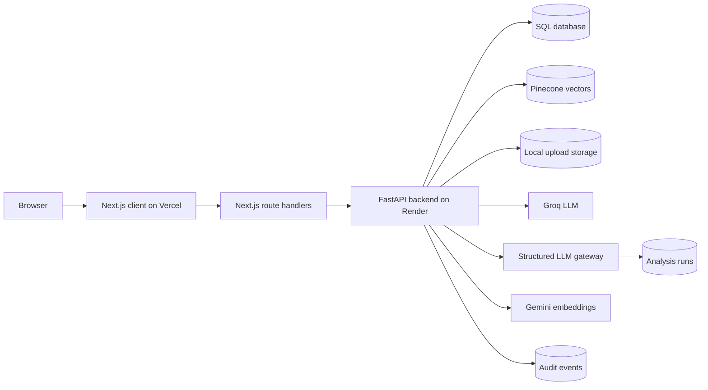
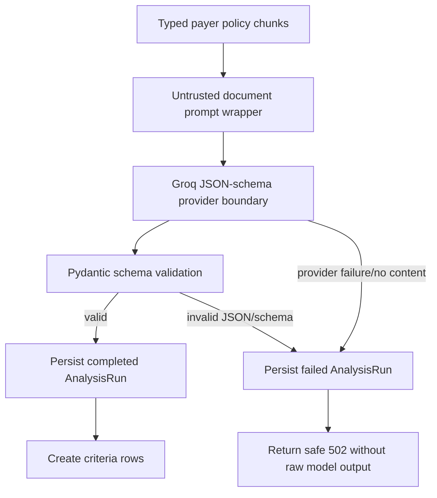
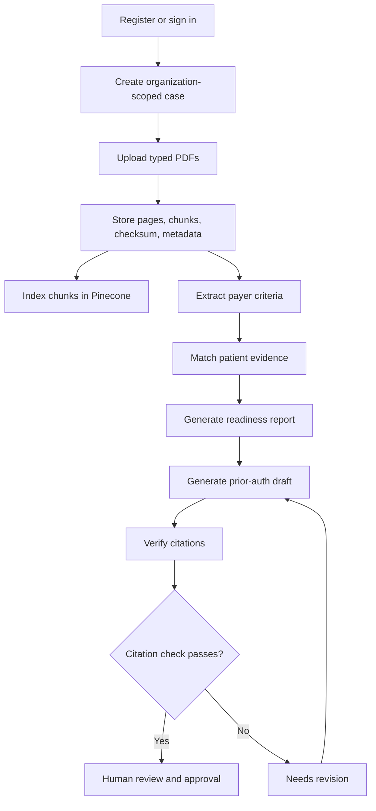
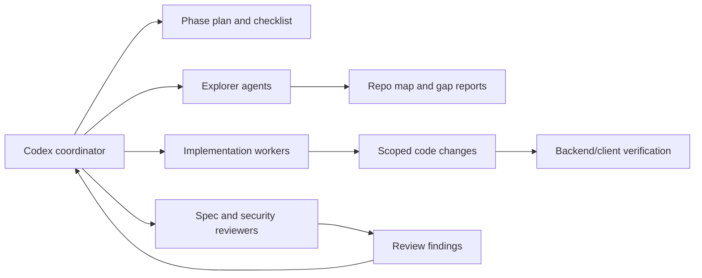

# AuthLens PriorAuth Evidence Copilot

AuthLens is evolving from a PDF Q&A demo into a case-based prior authorization evidence workspace. The current application supports synthetic or de-identified prior-auth and appeal cases, organization-scoped accounts, typed PDF uploads, payer-criteria extraction, patient-evidence matching, readiness reports, prior-auth and appeal draft generation, citation verification, audit events, exports, and human review state.

The original PDF chat routes still exist as compatibility and debug endpoints, but the product direction is the PriorAuth Evidence Copilot workflow.

## Safety Notice

Use synthetic or de-identified documents only. Do not upload real patient data, protected health information, confidential payer documents, or production clinical records into local demos, CI, previews, or shared accounts.

AuthLens does not diagnose, recommend treatment, guarantee payer approval, or replace clinician review. Readiness scores mean documentation completeness only, not approval likelihood.

## What The App Does

The prior-auth workflow is organized around an organization-owned case:

1. Register or sign in.
2. Create a prior-auth or appeal case such as a lumbar spine MRI request.
3. Upload typed PDFs, including payer policy documents, denial letters for appeals, and patient-supporting documents.
4. Store document metadata, pages, chunks, checksums, and vector IDs in the database.
5. Extract payer criteria from payer policy documents.
6. Match patient-document evidence against extracted criteria.
7. Generate a readiness report that describes documentation completeness.
8. Generate a prior-auth or appeal draft using verified evidence only.
9. Verify citations and require human review before approval.
10. Keep audit events for case changes, uploads, AI runs, reviewer edits, citation checks, and approvals.

## Current Status

Implemented:

- Self-service registration, login, forgot-password, reset-password, JWT auth, RBAC, and organization isolation.
- SQLAlchemy and Alembic persistence with SQLite for local/tests and Postgres-compatible deployment.
- Organization-scoped cases, typed documents, document pages, document chunks, analysis runs, criteria, evidence matches, readiness reports, drafts, citation checks, and audit events.
- Pinecone vector indexing for uploaded PDF chunks, with database records as the source of truth.
- Prior-auth criteria extraction, evidence matching, readiness report generation, draft generation, citation verification, and draft approval gates in the backend.
- Appeal draft generation from denial-letter uploads, including denial-reason citations and appeal-case checks.
- Next.js workspace with account flows, case list, prior-auth and appeal case creation, case detail workflow, typed upload, criteria/evidence/readiness/draft views, export controls, and backend proxy routes.
- Synthetic golden-case fixture runner and cross-tenant direct-ID regression tests.
- Readiness, letter, and packet markdown exports with persisted manifests and download routes.
- Structured LLM gateway foundation with Pydantic output schemas, opt-in criteria extraction, evidence matching, readiness reporting, redacted failed `AnalysisRun` recording, and untrusted-document prompt framing.
- Legacy `/api/upload_pdf/` and `/api/queries/` routes for the original PDF Q&A flow.

Next implementation phases:

- Expand synthetic evals beyond smoke checks into expected criteria, evidence-status, missing-item, and prompt-injection outcome scoring.
- Complete dependency audits, security scans, CI, and production deployment gates.
- Defer OCR, async workers, object storage, admin analytics, EHR/FHIR, payer submission, and real PHI readiness until after the MVP is stable.

## Runtime Architecture



Design rules:

- The database is the source of truth for users, organizations, cases, documents, chunks, analysis outputs, drafts, citations, and audit events.
- Pinecone is retrieval infrastructure, not the authoritative record.
- Browser calls go through Next.js route handlers. `BACKEND_API_URL` stays server-side in the client app.
- Backend routes enforce JWT auth, role checks, and `organization_id` filtering.
- Production config fails closed for missing `JWT_SECRET`, invalid CORS configuration, and internal-token mismatches.

## Structured LLM Gateway

Deterministic analysis remains the default. Set `PRIORAUTH_ANALYSIS_MODE=llm` only for controlled structured-output experiments backed by the Groq JSON-schema provider.



Current scope:

- `server/services/llm_gateway.py` calls Groq through a lazy JSON-schema request boundary, extracts raw JSON content, validates it with Pydantic, and records failed analysis runs for invalid output.
- `server/services/analysis_schemas.py` defines structured criteria, evidence, and readiness contracts.
- Criteria extraction, evidence matching, and readiness report generation have opt-in LLM branches behind `PRIORAUTH_ANALYSIS_MODE=llm`; deterministic analysis stays active by default and does not require a live LLM call.
- LLM evidence matching cites patient documents only. The service grounds each cited file, page, and quote to organization-scoped patient-document chunks before replacing stored matches.
- LLM readiness keeps deterministic documentation-completeness scoring as the source of truth; the model can structure the summary, highest-risk items, and reviewer next steps.
- Failed structured output stores schema/error-type metadata only. Raw PDF text, raw model output, and provider exception text are not stored in failure metadata.
- `PRIORAUTH_LLM_MODEL` selects the structured-analysis Groq model when set; otherwise the gateway falls back to `GROQ_MODEL`, then `llama-3.1-8b-instant`.

Remaining Phase 4 work:

- Expand the eval runner from smoke checks into expected criteria, evidence statuses, missing-item, and prompt-injection outcome checks.

## Prior-Auth Workflow



Retrieval isolation:

- Criteria extraction reads payer policy documents.
- Evidence matching reads patient documents only.
- Evidence status `met` is invalid without source quote, source file, source page, and rationale.
- Drafts must use verified evidence and keep the human-review disclaimer.
- Appeal drafts require an appeal case, an uploaded denial letter, and a readiness report.
- Appeal denial reasons must cite the denial-letter file and page; patient-evidence claims must cite verified patient evidence.

## Project Layout

- `server/` - FastAPI app, routers, services, SQLAlchemy models, Alembic entrypoint, Pinecone and LLM modules.
- `server/evals/` - synthetic golden cases and executable smoke eval runner.
- `client/` - Next.js App Router client, route handlers, workspace UI, client schemas, and tests.
- `tests/` - backend `unittest` suite.
- `docs/superpowers/plans/` - phase implementation plans for agentic workers.
- `tasks/todo.md` - active execution checklist and review notes.
- `render.yaml` - Render backend service configuration.
- `.circleci/config.yml` - backend and client CI jobs.

## Backend API

Auth:

- `POST /api/auth/register`
- `POST /api/auth/login`
- `POST /api/auth/forgot-password`
- `POST /api/auth/reset-password`
- `GET /api/auth/me`

Prior-auth workflow:

- `GET/POST /api/cases`
- `GET/PATCH /api/cases/{case_id}`
- `POST /api/cases/{case_id}/archive`
- `POST/GET /api/cases/{case_id}/documents`
- `GET /api/documents/{document_id}`
- `POST /api/cases/{case_id}/criteria/extract`
- `GET /api/cases/{case_id}/criteria`
- `PATCH /api/criteria/{criterion_id}`
- `POST /api/cases/{case_id}/evidence/match`
- `GET /api/cases/{case_id}/evidence`
- `PATCH /api/evidence-matches/{match_id}`
- `POST /api/cases/{case_id}/reports/readiness`
- `GET /api/cases/{case_id}/reports/latest`
- `POST /api/cases/{case_id}/drafts/prior-auth`
- `POST /api/cases/{case_id}/drafts/appeal`
- `GET /api/cases/{case_id}/drafts`
- `GET/PATCH /api/drafts/{draft_id}`
- `POST /api/drafts/{draft_id}/verify-citations`
- `POST /api/drafts/{draft_id}/approve`
- `POST /api/cases/{case_id}/exports/readiness-report`
- `POST /api/cases/{case_id}/exports/letter`
- `POST /api/cases/{case_id}/exports/packet`
- `GET /api/exports/{export_id}/download`
- `GET /api/cases/{case_id}/audit`
- `GET /api/audit`

Legacy debug routes:

- `POST /api/upload_pdf/`
- `POST /api/queries/`

Health:

- `GET /api/health/`

## Local Backend Development

Use Python 3.12 or newer. Backend dependencies are tracked in `server/requirements.txt`; the root `pyproject.toml` does not currently declare runtime dependencies.

```powershell
py -3.12 -m venv .venv
uv pip install --python .\.venv\Scripts\python.exe -r server\requirements.txt
```

Create a local backend env file from `.env.example`, then fill in real values locally only. Do not print or commit secrets.

```powershell
Copy-Item .env.example server\.env
.\.venv\Scripts\python.exe -m alembic -c alembic.ini upgrade head
Set-Location server
..\.venv\Scripts\python.exe -m uvicorn main:app --reload --host 127.0.0.1 --port 8000
```

The API should be started from `server/` so imports resolve the same way as the test suite.

## Local Client Development

```powershell
Set-Location client
Copy-Item .env.example .env.local
npm ci
npm run dev
```

The browser should use the Next.js app. Keep backend calls behind local route handlers rather than exposing the backend URL to browser JavaScript.

## Environment Variables

Backend variables:

| Name | Required | Notes |
| --- | --- | --- |
| `GROQ_API_KEY` | Yes | Secret Groq API key. |
| `GROQ_MODEL` | No | Defaults to `llama-3.1-8b-instant`. |
| `GOOGLE_API_KEY` | Yes | Secret key for Gemini embeddings. |
| `PINECONE_API_KEY` | Yes | Secret Pinecone API key. |
| `PINECONE_ENVIRONMENT` | Yes | Pinecone environment or region for the index. |
| `PINECONE_INDEX_NAME` | Yes | Pinecone index name. |
| `ALLOWED_ORIGINS` | Production | Comma-separated browser origins allowed to call the backend. |
| `DATABASE_URL` | Production | Defaults to local SQLite at `server/authlens.db`; use Postgres for deployment. |
| `JWT_SECRET` | Production | Required when `ENVIRONMENT=production`; local/test runs use a non-production fallback if unset. |
| `INTERNAL_API_TOKEN` | Production | Shared service token for client-to-backend calls when the backend enforces internal auth. |
| `MAX_UPLOAD_MB` | No | Upload size limit in megabytes. |
| `MAX_UPLOAD_FILES` | No | Maximum uploaded files per request. |
| `ENVIRONMENT` | No | Use `local`, `preview`, `test`, or `production`. |
| `PRIORAUTH_ANALYSIS_MODE` | No | Defaults to deterministic analysis. Set to `llm` only for structured-output experiments. |
| `PRIORAUTH_LLM_MODEL` | No | Groq model for structured prior-auth analysis; falls back to `GROQ_MODEL`, then `llama-3.1-8b-instant`. |
| `PRIORAUTH_LLM_MAX_TOKENS` | No | Maximum tokens for structured Groq responses; defaults to `2000`. |

Client variables:

| Name | Required | Notes |
| --- | --- | --- |
| `BACKEND_API_URL` | Yes | Server-side URL for the Render backend, for example `https://authlens-backend.onrender.com`. |
| `INTERNAL_API_TOKEN` | If backend uses it | Must match the backend value for service-to-service requests. |

Do not use `NEXT_PUBLIC_BACKEND_API_URL` for the backend service URL. Keep the backend URL server-side.

## Deployment

### Backend On Render

`render.yaml` defines the backend:

- Root directory: `server`
- Build command: `pip install -r requirements.txt`
- Start command: `python -m alembic -c ../alembic.ini upgrade head && uvicorn main:app --host 0.0.0.0 --port $PORT`
- Health check path: `/api/health/`

Use a managed Postgres `DATABASE_URL` for deployed environments. Keep SQLite for local and test use only. Render environment variables marked `sync: false` must be entered in the Render dashboard.

### Client On Vercel

Create a separate Vercel project for `client/` and set the project root to `client`.

Required values:

- `BACKEND_API_URL` as the Render backend base URL.
- `INTERNAL_API_TOKEN` if the backend requires it.

Set `ALLOWED_ORIGINS` on Render to the Vercel production domain and any preview/local origins you intentionally support.

## Verification Commands

Backend full suite:

```powershell
.\.venv\Scripts\python.exe -m unittest discover tests
```

Focused PRD guardrails:

```powershell
.\.venv\Scripts\python.exe -m unittest tests.test_phase7_eval_gate
.\.venv\Scripts\python.exe -m unittest tests.test_llm_gateway
.\.venv\Scripts\python.exe -m unittest tests.test_priorauth_workflow.PriorAuthWorkflowTests.test_cross_tenant_direct_id_routes_are_denied
```

Client checks:

```powershell
Set-Location client
npm run lint
npm run typecheck
npm run test
npm run build
npm run test:e2e
```

Security and dependency checks:

```powershell
Set-Location client
npm audit --audit-level=high
```

Run mocked unit tests before live Pinecone, Groq, or Gemini checks. Live checks require intentionally configured credentials, rate-limit awareness, and cost awareness.

Post-deploy smoke checks:

```powershell
curl.exe https://<render-backend-host>/api/health/
curl.exe https://<vercel-client-host>/
```

## CI

CircleCI runs independent backend and client jobs:

- `backend-test` installs `server/requirements.txt` and runs `python -m unittest discover tests`.
- `client-test-build` runs `npm ci`, `npm run lint`, `npm run typecheck`, `npm run test`, and `npm run build` from `client/`.

Dependency caches are optimizations only. A cache miss should still produce a clean install and test run.

## Multi-Agent Implementation Architecture

Implementation work is tracked in `tasks/todo.md` and phase plans under `docs/superpowers/plans/`. The workflow uses scoped agents for discovery, implementation, review, and verification rather than one broad pass.



Agent roles:

- Explorer agents map current code, tests, and gaps without editing.
- Worker slices stay scoped to one backend, client, eval, or docs surface.
- Reviewer agents check spec compliance, security, tenant isolation, and product-safety language before a phase is considered stable.
- The main coordinator owns final integration, verification commands, and README/task updates.

## Roadmap

Immediate next phases are tracked in `tasks/todo.md` and `docs/superpowers/plans/2026-06-18-next-prd-phases.md`:

1. Phase 0 - Implemented: executable eval and tenant-isolation guardrails.
2. Phase 1 - Implemented: reviewer workspace controls for criteria, evidence, draft, citation, and approval review.
3. Phase 2 - Implemented: readiness, letter, and packet exports with markdown downloads and packet manifests.
4. Phase 3 - Implemented: denial-letter appeal workflow with appeal-case checks and denial-letter citation verification.
5. Phase 4 - In progress: structured Groq provider boundary and opt-in criteria/evidence/readiness branches are implemented; expanded eval scoring remains.
6. Phase 5 - Harden auth/session behavior, security scans, CI, and deployment gates.

Deferred capabilities include OCR fallback, async processing workers, object storage, admin analytics, EHR/FHIR integration, payer submission, and real PHI production readiness.
