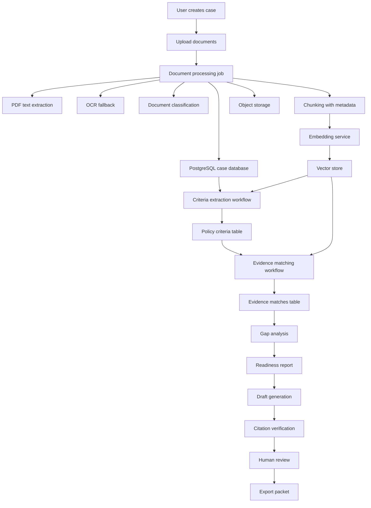
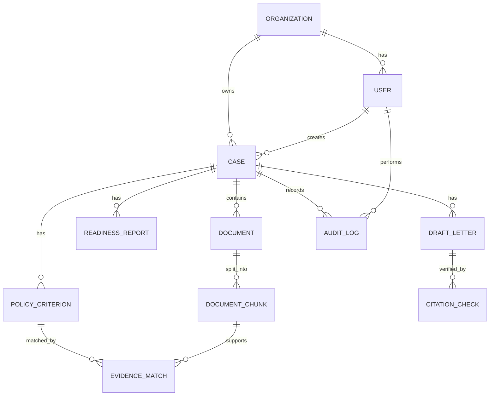
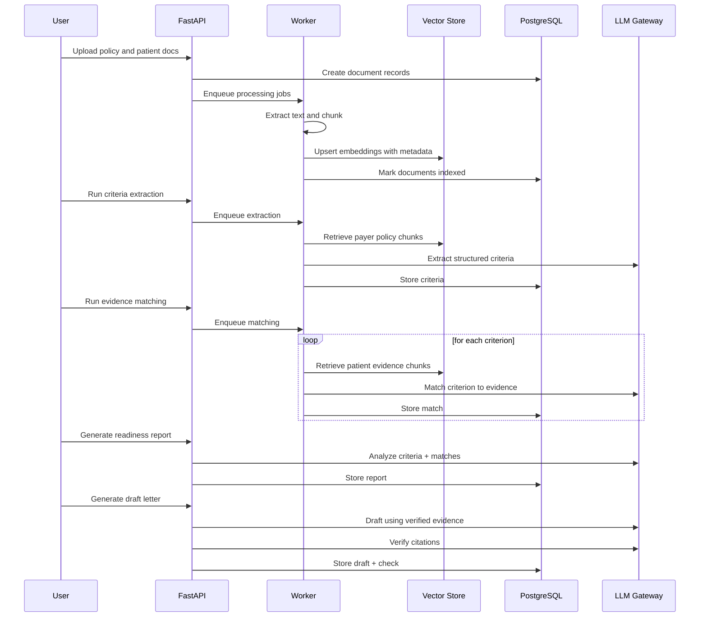

# PriorAuth Evidence Copilot — Product Requirements Document

**Version:** 0.1  
**Status:** Draft for technical investigation  
**Generated:** 2026-06-16  
**Primary audience:** Coding agent, founder/developer, product reviewer  
**Working project name:** PriorAuth Evidence Copilot  
**Source inspiration:** End-to-end Medical AI Assistant RAG tutorial using FastAPI, LangChain, Pinecone, Groq/LLaMA, document upload, retrieval, and answer generation.

---

## 1. Executive Summary

PriorAuth Evidence Copilot is a healthcare operations platform that helps clinic staff and clinicians prepare **prior authorization** and **appeal** packets by analyzing payer policy documents and patient documentation.

The product is not a diagnostic assistant and must not make medical decisions. It is a documentation-support tool that helps users answer one operational question:

> “Does the uploaded patient documentation contain the evidence required by this payer policy, and what is missing before a human submits the prior authorization or appeal packet?”

The platform uses retrieval-augmented generation (RAG), structured extraction, evidence matching, citation verification, and human review workflows. The initial MVP should use **synthetic or de-identified data only**.

---

## 2. Problem Statement

Clinics often need to prepare prior authorization requests and appeals by manually reviewing payer policy PDFs, progress notes, lab reports, imaging reports, medication histories, referral letters, and denial letters. This process is time-consuming, error-prone, and highly dependent on finding the exact evidence that satisfies payer-specific requirements.

A generic medical PDF chatbot can answer questions about uploaded documents, but it does not solve the workflow problem. The more valuable product is a structured evidence-preparation platform that converts payer policy text into criteria, matches each criterion against patient documents, identifies missing documentation, and drafts a human-reviewed packet.

---

## 3. Product Vision

Build an AI-assisted prior authorization workspace that turns unstructured payer policies and patient documents into an audit-ready, citation-backed review packet.

The platform should help users:

1. Create a prior authorization or appeal case.
2. Upload payer policy documents and patient documentation.
3. Extract payer criteria into a structured checklist.
4. Match patient evidence against each criterion.
5. Flag missing, unclear, or contradictory documentation.
6. Draft a prior authorization or appeal letter.
7. Verify that every claim is supported by citations.
8. Require human review before export or submission.

---

## 4. Product Positioning

### 4.1 One-line positioning

**PriorAuth Evidence Copilot helps clinic teams prepare citation-backed prior authorization and appeal packets faster by matching payer requirements to patient documentation.**

### 4.2 What it is

- A clinical documentation support tool.
- A payer-policy evidence matching system.
- A prior authorization readiness checker.
- A draft packet generator for human review.
- A RAG-based workflow application, not a general chatbot.

### 4.3 What it is not

- Not a diagnostic assistant.
- Not a treatment recommendation engine.
- Not an autonomous medical decision-maker.
- Not an insurance approval guarantee engine.
- Not a production PHI system in the MVP.
- Not a replacement for clinician or administrative review.

---

## 5. Source Tutorial Relationship

The referenced tutorial is useful as a technical foundation because it demonstrates a modular RAG medical assistant architecture with PDF upload, text extraction, chunking, embeddings, Pinecone vector storage, FastAPI endpoints, LangChain orchestration, Groq/LLaMA generation, and deployment.

Use the tutorial as **Version 0**, then evolve it into a workflow product.

### 5.1 Reusable tutorial components

| Tutorial capability | Reuse level | Adaptation required |
|---|---:|---|
| PDF upload | High | Add case ID, organization ID, document type, payer, service, source metadata. |
| Text extraction | Medium | Add page preservation, OCR fallback, section headings, and document classification. |
| Text splitting | Medium | Replace generic chunking with document-type-aware chunking. |
| Embeddings | High | Use for policy retrieval and patient evidence retrieval. |
| Pinecone or vector store | High | Add metadata filters, namespaces, and source/case isolation. |
| FastAPI backend | High | Expand from generic upload/ask endpoints to case workflow endpoints. |
| Generic `/ask` RAG endpoint | Low | Keep only for debugging; replace with structured workflow endpoints. |
| Streamlit frontend | Medium | Useful for prototype; likely replace with Next.js or a richer dashboard later. |
| Render deployment | Medium | Useful for demo; not sufficient for production PHI workflows. |

### 5.2 Major platform additions beyond the tutorial

- Case management.
- Multi-tenant organization model.
- Document type classification.
- Payer criteria extraction.
- Evidence matching per criterion.
- Missing documentation analysis.
- Citation verification.
- Draft prior authorization letter.
- Draft appeal letter.
- Human approval workflow.
- PDF/DOCX export.
- Audit trail.
- Authentication and role-based authorization.
- Security controls appropriate for sensitive data.
- Evaluation suite for retrieval, extraction, citation accuracy, and unsupported claims.

---

## 6. Goals and Non-Goals

### 6.1 Goals

| ID | Goal | Description |
|---|---|---|
| G-001 | Reduce manual review burden | Help users quickly identify payer criteria and matching patient evidence. |
| G-002 | Improve documentation completeness | Flag missing or unclear documentation before packet submission. |
| G-003 | Increase traceability | Every material claim must cite source file, page, and short quote where possible. |
| G-004 | Support human review | Require clinician/admin review before final export. |
| G-005 | Build from tutorial foundation | Reuse RAG ingestion/retrieval architecture but convert it into a workflow app. |
| G-006 | Make it demo-safe | MVP uses synthetic or de-identified data; no real PHI. |

### 6.2 Non-Goals

| ID | Non-goal | Rationale |
|---|---|---|
| NG-001 | Diagnose patients | The product is documentation support, not clinical diagnosis. |
| NG-002 | Recommend treatment | Treatment decisions must remain with licensed clinicians. |
| NG-003 | Guarantee approval | Payer decisions cannot be guaranteed. |
| NG-004 | Submit automatically to payers in MVP | Human review and export-only workflow reduces risk. |
| NG-005 | Integrate with live EHR in MVP | Use upload-based workflow first; FHIR/EHR integration can come later. |
| NG-006 | Support every specialty initially | Start with one or two focused workflows to improve quality. |

---

## 7. Target Users and Personas

### 7.1 Primary persona: Prior Authorization Coordinator

**Profile:** Administrative or clinical operations staff member who prepares PA packets.  
**Pain points:** Must read payer policies, gather chart evidence, check documentation, and create submission materials.  
**Success criteria:** Faster packet preparation, fewer missing-document issues, less manual searching.

### 7.2 Secondary persona: Clinician Reviewer

**Profile:** Physician, nurse practitioner, physician assistant, or other authorized clinical reviewer.  
**Pain points:** Needs to verify that draft letters accurately reflect chart documentation.  
**Success criteria:** Can quickly see criteria, evidence, missing items, and citations.

### 7.3 Secondary persona: Clinic Administrator

**Profile:** Operations manager or revenue-cycle leader.  
**Pain points:** Wants visibility into case status, bottlenecks, denial reasons, and workload.  
**Success criteria:** Dashboard showing cases by status, common missing items, time-to-ready, and denial categories.

### 7.4 Future persona: Payer-facing Submission Specialist

**Profile:** Person responsible for submitting packets to payer portals or APIs.  
**Pain points:** Must adapt packet format to payer-specific submission requirements.  
**Success criteria:** Export-ready packet and checklist matched to payer requirements.

---

## 8. Primary Use Cases

### UC-001: Prior authorization readiness check

A coordinator creates a case for a requested service, uploads the payer policy and patient documentation, runs analysis, and receives a readiness report showing which payer criteria are met, missing, or unclear.

### UC-002: Missing documentation checklist

A coordinator needs to know what to ask the clinician to add before submission. The system identifies missing elements such as duration of conservative therapy, prior medication trials, lab thresholds, imaging findings, or functional limitation details.

### UC-003: Draft prior authorization letter

After evidence matching, the system drafts a concise letter using only verified evidence, with citations to patient documents and payer policy pages.

### UC-004: Draft appeal letter

When a denial letter is uploaded, the system extracts the denial reason, maps it to payer criteria and patient evidence, and drafts a professional appeal letter for human review.

### UC-005: Human review and export

A clinician or authorized reviewer reviews the criteria/evidence table, edits the letter, confirms citations, and exports a packet.

### UC-006: Case analytics

An administrator reviews aggregate metrics such as common missing evidence, readiness scores by service, and average time from document upload to packet-ready status.

---

## 9. MVP Scope

### 9.1 Recommended MVP specialty/service focus

Pick one starting domain to reduce ambiguity. Recommended demo options:

1. Lumbar spine MRI prior authorization.
2. Sleep study prior authorization.
3. Biologic medication prior authorization for dermatology or rheumatology.
4. Physical therapy extension authorization.

For the first build, **Lumbar spine MRI** is recommended because payer policies often contain explicit criteria, and synthetic patient notes are easy to generate for demo purposes.

### 9.2 MVP includes

- User login for demo users.
- Organization workspace.
- Case creation.
- Upload payer policy PDF.
- Upload patient packet PDFs.
- Optional upload denial letter PDF.
- Document parsing with page-level metadata.
- Vector indexing with case/document metadata.
- Payer criteria extraction to structured JSON.
- Evidence matching per criterion.
- Readiness report.
- Draft prior authorization letter.
- Draft appeal letter if denial letter exists.
- Citation verification pass.
- Export to Markdown/PDF/DOCX in later MVP iteration.
- Audit log of major actions.

### 9.3 MVP excludes

- Real PHI use.
- Live EHR connection.
- Payer portal submission.
- Automated medical determinations.
- Direct patient-facing usage.
- Billing integration.
- Full CMS prior authorization API implementation.
- Specialty-wide policy library.

---

## 10. User Experience Requirements

### 10.1 Navigation model

Core screens:

1. Login.
2. Organization dashboard.
3. Case list.
4. Case detail.
5. Document upload and classification.
6. Extracted criteria checklist.
7. Evidence matching table.
8. Gap analysis/readiness report.
9. Draft letter editor.
10. Export/review screen.
11. Audit trail.
12. Admin analytics.

### 10.2 Case dashboard fields

Each case card/table row should show:

- Case ID.
- Patient label or synthetic patient ID.
- Requested service.
- Payer.
- Specialty.
- Case type: prior authorization or appeal.
- Status.
- Readiness score.
- Missing required criteria count.
- Last updated timestamp.
- Assigned reviewer.

### 10.3 Case statuses

| Status | Description |
|---|---|
| `draft` | Case created but documents incomplete. |
| `documents_uploaded` | Required documents uploaded. |
| `criteria_extracted` | Payer criteria extracted. |
| `evidence_matched` | Patient evidence matched to criteria. |
| `needs_more_documentation` | Missing or unclear items found. |
| `ready_for_review` | Packet appears complete enough for human review. |
| `review_in_progress` | Human reviewer editing/checking draft. |
| `approved_for_export` | Human reviewer approved export. |
| `exported` | Packet exported. |
| `archived` | Case closed or removed from active queue. |

### 10.4 Evidence matching table

Columns:

- Criterion ID.
- Payer requirement.
- Required evidence.
- Status: met / unclear / not found / not met.
- Evidence summary.
- Source quote.
- Source file.
- Page.
- Confidence.
- Recommended action.
- Reviewer override.

### 10.5 Review UX principles

- Show policy criteria and patient evidence side by side.
- Show citations as clickable source references.
- Highlight missing evidence in a separate “Action Needed” section.
- Never hide uncertainty.
- Allow human overrides with required reason.
- Store every AI output version and reviewer edit in audit logs.

---

## 11. Functional Requirements

### 11.1 Case Management

| ID | Requirement | Priority | Acceptance Criteria |
|---|---|---:|---|
| FR-001 | Users can create a case. | P0 | Case has unique ID, payer, requested service, specialty, status, and timestamps. |
| FR-002 | Users can edit case metadata. | P0 | Updates are saved and audit logged. |
| FR-003 | Users can view all cases in their organization. | P0 | Case list filters by status, payer, service, assigned user. |
| FR-004 | Users cannot view cases outside their organization. | P0 | API enforces organization-level access control. |
| FR-005 | Users can archive cases. | P1 | Archived cases are hidden by default but recoverable by admins. |

### 11.2 Document Upload and Processing

| ID | Requirement | Priority | Acceptance Criteria |
|---|---|---:|---|
| FR-010 | Users can upload PDFs to a case. | P0 | System accepts PDF files and associates each file with case ID and doc type. |
| FR-011 | Users can select document type. | P0 | Supported types: payer_policy, patient_note, lab_result, imaging_report, denial_letter, medication_history, referral_letter, other. |
| FR-012 | System extracts text with page numbers. | P0 | Chunks preserve source file and page metadata. |
| FR-013 | System stores raw file securely. | P0 | File object has stable URI/path, checksum, size, and upload timestamp. |
| FR-014 | System chunks text for retrieval. | P0 | Chunks include text, page range, section heading when available, document type, case ID. |
| FR-015 | System embeds chunks and stores vectors. | P0 | Vector records include metadata needed for filtered retrieval. |
| FR-016 | System handles extraction failures. | P0 | User sees actionable error and processing status. |
| FR-017 | OCR fallback is available for scanned PDFs. | P1 | Scanned pages are detected and OCR result is stored with confidence. |

### 11.3 Payer Criteria Extraction

| ID | Requirement | Priority | Acceptance Criteria |
|---|---|---:|---|
| FR-020 | System extracts criteria from payer policy. | P0 | Output is structured JSON and tied to source citations. |
| FR-021 | Criteria include type, requirement, evidence needed, required flag, quote, source file/page, confidence. | P0 | Each criterion row has required fields or explicit unknown values. |
| FR-022 | User can review and edit extracted criteria. | P0 | Edits are versioned and audit logged. |
| FR-023 | System flags ambiguous policy language. | P1 | Ambiguous or missing policy info appears in a separate section. |
| FR-024 | System supports re-running extraction. | P1 | Previous criteria version remains available for comparison. |

### 11.4 Evidence Matching

| ID | Requirement | Priority | Acceptance Criteria |
|---|---|---:|---|
| FR-030 | System matches patient evidence to each criterion. | P0 | Each criterion receives status: met, unclear, not_found, not_met. |
| FR-031 | Evidence matches include source quote, source file, page, and rationale. | P0 | No “met” status without supporting source evidence. |
| FR-032 | System separates policy retrieval from patient evidence retrieval. | P0 | Evidence matching searches patient docs, not payer policy docs. |
| FR-033 | System identifies missing evidence. | P0 | Missing items are specific and actionable. |
| FR-034 | System identifies conflicting evidence. | P1 | Conflicts appear in report and prevent automatic ready status. |
| FR-035 | User can override match status. | P1 | Override requires reason and is audit logged. |

### 11.5 Gap Analysis and Readiness Report

| ID | Requirement | Priority | Acceptance Criteria |
|---|---|---:|---|
| FR-040 | System generates readiness score. | P0 | Score reflects documentation completeness, not approval probability. |
| FR-041 | System generates overall status. | P0 | Values: ready_for_review, needs_more_documentation, high_risk_of_denial, insufficient_information. |
| FR-042 | System lists highest-risk missing items. | P0 | Required missing criteria appear at top. |
| FR-043 | System recommends clinician/admin actions. | P0 | Actions are concrete, e.g., “document PT start/end dates.” |
| FR-044 | Report is exportable. | P1 | Report can be exported to Markdown/PDF/DOCX. |

### 11.6 Draft Generation

| ID | Requirement | Priority | Acceptance Criteria |
|---|---|---:|---|
| FR-050 | System drafts prior authorization letter. | P0 | Draft uses only verified evidence and includes citations. |
| FR-051 | System drafts appeal letter when denial letter is available. | P0 | Draft addresses extracted denial reason directly. |
| FR-052 | Drafts include disclaimers for clinician/admin review. | P0 | Every draft states it is not final and requires review. |
| FR-053 | Draft editor allows human edits. | P1 | Human edits are versioned. |
| FR-054 | Draft cannot be marked ready if citation verification fails. | P0 | Unsupported claims block ready-for-export status. |

### 11.7 Citation Verification

| ID | Requirement | Priority | Acceptance Criteria |
|---|---|---:|---|
| FR-060 | System checks draft claims against source evidence. | P0 | Unsupported, weakly supported, or citation-error claims are flagged. |
| FR-061 | System stores citation verification result. | P0 | Result includes status: pass, needs_revision, fail. |
| FR-062 | System blocks export on fail unless reviewer override is recorded. | P1 | Override reason and user ID are saved. |

### 11.8 Human Review

| ID | Requirement | Priority | Acceptance Criteria |
|---|---|---:|---|
| FR-070 | Reviewer can approve packet for export. | P0 | Approval requires user identity and timestamp. |
| FR-071 | Reviewer can request more documentation. | P0 | Case status updates and action items are created. |
| FR-072 | System maintains audit trail. | P0 | All major AI and human actions are logged. |

### 11.9 Export

| ID | Requirement | Priority | Acceptance Criteria |
|---|---|---:|---|
| FR-080 | System exports readiness report. | P1 | Export includes criteria table, evidence, gaps, and citations. |
| FR-081 | System exports letter draft. | P1 | Export includes final reviewed text and attachments checklist. |
| FR-082 | System exports packet manifest. | P1 | Manifest lists included documents, pages, and evidence references. |

### 11.10 Admin Analytics

| ID | Requirement | Priority | Acceptance Criteria |
|---|---|---:|---|
| FR-090 | Admin can view case counts by status. | P2 | Dashboard shows active, ready, needs docs, exported. |
| FR-091 | Admin can view common missing criteria. | P2 | Missing item categories are aggregated. |
| FR-092 | Admin can view average time-to-ready. | P2 | Time computed from upload completion to ready_for_review. |

---

## 12. Non-Functional Requirements

### 12.1 Security

| ID | Requirement | Priority |
|---|---|---:|
| NFR-001 | Use authentication for all non-public endpoints. | P0 |
| NFR-002 | Enforce organization-level tenant isolation. | P0 |
| NFR-003 | Implement role-based access control. | P0 |
| NFR-004 | Encrypt data in transit with TLS. | P0 |
| NFR-005 | Encrypt stored files and sensitive database fields where appropriate. | P0 |
| NFR-006 | Do not log raw patient document contents in application logs. | P0 |
| NFR-007 | Store secrets only in environment/secret manager, never in code. | P0 |
| NFR-008 | Provide audit logs for access, processing, edits, exports, and overrides. | P0 |
| NFR-009 | Add rate limiting to upload, analysis, and generation endpoints. | P1 |
| NFR-010 | Add malware/file validation for uploads before processing. | P1 |

### 12.2 Privacy and compliance posture

| ID | Requirement | Priority |
|---|---|---:|
| NFR-020 | MVP must use synthetic or de-identified data only. | P0 |
| NFR-021 | UI must clearly state demo/non-production data limitation. | P0 |
| NFR-022 | Production use with PHI requires appropriate privacy/security review. | P0 |
| NFR-023 | Production use requires vendor/data-processing review for all model, vector DB, storage, and logging providers. | P0 |
| NFR-024 | Product copy must avoid diagnostic or treatment claims. | P0 |

### 12.3 Reliability

| ID | Requirement | Priority |
|---|---|---:|
| NFR-030 | Document processing jobs should be asynchronous and retryable. | P0 |
| NFR-031 | System should survive LLM provider transient failures. | P0 |
| NFR-032 | Failed jobs must expose user-readable status. | P0 |
| NFR-033 | Vector indexing must be idempotent by document checksum + chunk ID. | P1 |

### 12.4 Performance

| ID | Requirement | Target |
|---|---|---:|
| NFR-040 | Upload acknowledgment latency | < 5 seconds for file receipt. |
| NFR-041 | Text extraction for 20-page PDF | < 60 seconds in MVP. |
| NFR-042 | Criteria extraction | < 90 seconds for focused policy section. |
| NFR-043 | Evidence matching | < 2 minutes for 10 criteria and small patient packet. |
| NFR-044 | Draft generation | < 45 seconds. |
| NFR-045 | Dashboard page load | < 3 seconds for normal case list. |

### 12.5 Quality

| ID | Requirement | Target |
|---|---|---:|
| NFR-050 | Criterion extraction precision on synthetic evals | ≥ 85% for required criteria. |
| NFR-051 | Evidence match citation precision | ≥ 90% of cited quotes actually support status. |
| NFR-052 | Unsupported claim rate in final drafts | 0 critical unsupported claims in review set. |
| NFR-053 | JSON schema validity | ≥ 99% after automatic repair/retry. |

---

## 13. Recommended Technical Architecture

### 13.1 High-level architecture



### 13.2 Core services

| Service | Responsibility |
|---|---|
| API service | FastAPI endpoints, authentication, request validation. |
| Worker service | Async document processing, OCR, chunking, embeddings, AI workflows. |
| Database | Cases, users, documents, criteria, evidence matches, drafts, audit logs. |
| Object storage | Raw uploaded PDFs and generated exports. |
| Vector store | Searchable chunks with metadata filtering. |
| LLM gateway | Provider abstraction, retries, logging redaction, schema validation. |
| Evaluation service | Test synthetic cases and track quality metrics. |

### 13.3 Suggested stack

| Layer | MVP suggestion | Notes |
|---|---|---|
| Backend | FastAPI | Matches tutorial foundation. |
| Frontend | Streamlit for prototype, Next.js for serious MVP | Streamlit is fast; Next.js is better for review UI. |
| Database | PostgreSQL | Source of truth for cases and structured data. |
| Vector store | Pinecone or pgvector | Pinecone matches tutorial; pgvector simplifies infra. |
| File storage | Local dev filesystem, S3-compatible object storage later | Store checksum and metadata in DB. |
| Job queue | Celery/RQ/Arq | Required for async processing. |
| Document parsing | PyMuPDF/pdfplumber, Unstructured or LlamaParse optional | Preserve page numbers. |
| OCR | Tesseract or cloud OCR later | Use only for scanned PDFs. |
| LLM orchestration | LangChain/LangGraph or lightweight custom orchestration | LangGraph useful for multi-step workflows. |
| Structured output | Pydantic models + JSON schema validation | Avoid free-form parsing. |
| Authentication | JWT/OAuth2 in MVP | Add RBAC and tenant isolation. |

---

## 14. Repository Structure Recommendation

```text
priorauth-evidence-copilot/
  README.md
  PRD.md
  AGENTS.md
  .env.example
  docker-compose.yml
  server/
    pyproject.toml
    app/
      main.py
      config.py
      dependencies.py
      api/
        routes/
          auth.py
          cases.py
          documents.py
          criteria.py
          evidence.py
          reports.py
          drafts.py
          exports.py
          audit.py
      core/
        security.py
        logging.py
        errors.py
      db/
        session.py
        models.py
        migrations/
      schemas/
        case.py
        document.py
        criterion.py
        evidence.py
        report.py
        draft.py
        audit.py
      services/
        document_ingestion.py
        document_classifier.py
        chunking.py
        embeddings.py
        vector_store.py
        retrieval.py
        criteria_extractor.py
        evidence_matcher.py
        gap_analyzer.py
        draft_writer.py
        citation_verifier.py
        export_service.py
        audit_service.py
        llm_gateway.py
      workers/
        jobs.py
        queue.py
      tests/
        unit/
        integration/
        evals/
  client/
    README.md
    src/
      pages-or-app/
      components/
      lib/
      api/
  docs/
    architecture.md
    data-model.md
    eval-plan.md
    synthetic-demo-data.md
```

---

## 15. Data Model

### 15.1 Entity relationship overview



### 15.2 Core tables

#### `organizations`

| Field | Type | Notes |
|---|---|---|
| id | UUID | Primary key. |
| name | text | Organization name. |
| plan | text | demo/free/internal. |
| created_at | timestamp |  |
| updated_at | timestamp |  |

#### `users`

| Field | Type | Notes |
|---|---|---|
| id | UUID | Primary key. |
| organization_id | UUID | Foreign key. |
| email | text | Unique per organization or globally. |
| name | text |  |
| role | enum | admin, coordinator, clinician_reviewer, viewer. |
| password_hash | text | If using local auth. |
| is_active | boolean |  |
| created_at | timestamp |  |
| updated_at | timestamp |  |

#### `cases`

| Field | Type | Notes |
|---|---|---|
| id | UUID | Primary key. |
| organization_id | UUID | Tenant isolation. |
| created_by_user_id | UUID |  |
| assigned_to_user_id | UUID | Nullable. |
| case_label | text | Avoid real PHI in demo. |
| patient_label | text | Synthetic ID or initials only in MVP. |
| payer_name | text |  |
| plan_name | text | Optional. |
| specialty | text | e.g., radiology. |
| requested_service | text | e.g., lumbar spine MRI. |
| service_code | text | Optional CPT/HCPCS/NDC. |
| diagnosis_summary | text | Optional synthetic summary. |
| case_type | enum | prior_auth, appeal. |
| status | enum | See status list. |
| readiness_score | numeric | 0-100, nullable. |
| created_at | timestamp |  |
| updated_at | timestamp |  |
| archived_at | timestamp | Nullable. |

#### `documents`

| Field | Type | Notes |
|---|---|---|
| id | UUID | Primary key. |
| case_id | UUID | Foreign key. |
| organization_id | UUID | Denormalized for safety filtering. |
| uploaded_by_user_id | UUID |  |
| document_type | enum | payer_policy, patient_note, lab_result, etc. |
| file_name | text |  |
| file_uri | text | Object storage path. |
| sha256 | text | Deduplication and integrity. |
| mime_type | text |  |
| page_count | int | Nullable until processed. |
| processing_status | enum | pending, processing, indexed, failed. |
| extraction_method | enum | text, ocr, mixed, failed. |
| error_message | text | Nullable. |
| created_at | timestamp |  |
| updated_at | timestamp |  |

#### `document_chunks`

| Field | Type | Notes |
|---|---|---|
| id | UUID | Primary key. |
| document_id | UUID | Foreign key. |
| case_id | UUID | Foreign key. |
| organization_id | UUID | Tenant isolation. |
| chunk_index | int |  |
| text | text | Store in DB or vector metadata depending privacy design. |
| page_start | int |  |
| page_end | int |  |
| section_heading | text | Nullable. |
| token_count | int |  |
| vector_id | text | ID in vector DB. |
| created_at | timestamp |  |

#### `policy_criteria`

| Field | Type | Notes |
|---|---|---|
| id | UUID | Primary key. |
| case_id | UUID | Foreign key. |
| criterion_code | text | Human-readable ID, e.g., C1. |
| criterion_type | enum | medical_necessity, documentation, exclusion, administrative, other. |
| requirement | text | Requirement statement. |
| required_evidence | jsonb | Array of evidence types. |
| is_required | boolean |  |
| source_document_id | UUID | Nullable. |
| source_file | text |  |
| source_page | text | Page or range. |
| source_quote | text | Short quote. |
| confidence | numeric | 0-1. |
| extraction_version | int |  |
| reviewed_by_user_id | UUID | Nullable. |
| reviewer_status | enum | unreviewed, accepted, edited, rejected. |
| created_at | timestamp |  |
| updated_at | timestamp |  |

#### `evidence_matches`

| Field | Type | Notes |
|---|---|---|
| id | UUID | Primary key. |
| criterion_id | UUID | Foreign key. |
| case_id | UUID | Foreign key. |
| status | enum | met, unclear, not_found, not_met. |
| evidence_summary | text |  |
| source_document_id | UUID | Nullable when not found. |
| source_chunk_id | UUID | Nullable. |
| source_file | text |  |
| source_page | text |  |
| source_quote | text |  |
| why_it_matters | text |  |
| missing_evidence | jsonb | Array. |
| conflicting_evidence | jsonb | Array. |
| recommended_action | text |  |
| confidence | numeric | 0-1. |
| model_version | text |  |
| reviewed_by_user_id | UUID | Nullable. |
| reviewer_override_status | enum | Nullable. |
| reviewer_override_reason | text | Nullable. |
| created_at | timestamp |  |
| updated_at | timestamp |  |

#### `readiness_reports`

| Field | Type | Notes |
|---|---|---|
| id | UUID | Primary key. |
| case_id | UUID | Foreign key. |
| readiness_score | numeric | 0-100. |
| overall_status | enum | ready_for_review, needs_more_documentation, high_risk_of_denial, insufficient_information. |
| summary | text |  |
| highest_risk_items | jsonb | Array. |
| recommended_next_steps | jsonb | Array. |
| report_json | jsonb | Full structured report. |
| created_at | timestamp |  |

#### `draft_letters`

| Field | Type | Notes |
|---|---|---|
| id | UUID | Primary key. |
| case_id | UUID | Foreign key. |
| letter_type | enum | prior_auth, appeal. |
| status | enum | draft, needs_revision, ready_for_review, approved, exported. |
| content_markdown | text |  |
| model_version | text |  |
| source_report_id | UUID | Nullable. |
| created_by | enum | ai, user. |
| reviewed_by_user_id | UUID | Nullable. |
| approved_at | timestamp | Nullable. |
| created_at | timestamp |  |
| updated_at | timestamp |  |

#### `citation_checks`

| Field | Type | Notes |
|---|---|---|
| id | UUID | Primary key. |
| draft_letter_id | UUID | Foreign key. |
| verification_status | enum | pass, needs_revision, fail. |
| unsupported_claims | jsonb | Array. |
| weakly_supported_claims | jsonb | Array. |
| citation_errors | jsonb | Array. |
| safe_to_show_user | boolean |  |
| created_at | timestamp |  |

#### `audit_logs`

| Field | Type | Notes |
|---|---|---|
| id | UUID | Primary key. |
| organization_id | UUID |  |
| case_id | UUID | Nullable. |
| user_id | UUID | Nullable for system actions. |
| actor_type | enum | user, system, worker. |
| action | text | e.g., document.uploaded, criteria.extracted. |
| entity_type | text |  |
| entity_id | UUID | Nullable. |
| metadata | jsonb | Redacted metadata only. |
| created_at | timestamp |  |

---

## 16. Vector Metadata Schema

Every vector record should include metadata that supports safe, precise filtering.

```json
{
  "organization_id": "org_123",
  "case_id": "case_123",
  "document_id": "doc_123",
  "document_type": "payer_policy",
  "file_name": "example_policy.pdf",
  "page_start": 4,
  "page_end": 4,
  "section_heading": "Medical Necessity Criteria",
  "chunk_index": 12,
  "text": "Short chunk text or pointer depending privacy design",
  "created_at": "2026-06-16T00:00:00Z"
}
```

### 16.1 Required filtering patterns

- Retrieve policy criteria:

```json
{
  "organization_id": "org_123",
  "case_id": "case_123",
  "document_type": "payer_policy"
}
```

- Retrieve patient evidence:

```json
{
  "organization_id": "org_123",
  "case_id": "case_123",
  "document_type": {"$in": ["patient_note", "lab_result", "imaging_report", "medication_history", "referral_letter"]}
}
```

- Retrieve denial context:

```json
{
  "organization_id": "org_123",
  "case_id": "case_123",
  "document_type": "denial_letter"
}
```

---

## 17. API Requirements

### 17.1 Auth

```http
POST /api/auth/login
POST /api/auth/logout
GET  /api/auth/me
```

### 17.2 Cases

```http
POST   /api/cases
GET    /api/cases
GET    /api/cases/{case_id}
PATCH  /api/cases/{case_id}
POST   /api/cases/{case_id}/archive
```

Example `POST /api/cases` request:

```json
{
  "patient_label": "SYN-001",
  "payer_name": "Example Health Plan",
  "specialty": "Radiology",
  "requested_service": "Lumbar spine MRI",
  "service_code": "72148",
  "case_type": "prior_auth"
}
```

### 17.3 Documents

```http
POST /api/cases/{case_id}/documents
GET  /api/cases/{case_id}/documents
GET  /api/documents/{document_id}
POST /api/documents/{document_id}/reprocess
```

Example multipart fields:

```text
document_type=payer_policy
file=<PDF>
```

### 17.4 Criteria extraction

```http
POST /api/cases/{case_id}/criteria/extract
GET  /api/cases/{case_id}/criteria
PATCH /api/criteria/{criterion_id}
```

Example response:

```json
{
  "criteria": [
    {
      "criterion_id": "C1",
      "criterion_type": "medical_necessity",
      "requirement": "At least six weeks of conservative therapy must be documented before advanced imaging.",
      "required_evidence": ["physical therapy notes", "medication trial", "activity modification"],
      "is_required": true,
      "source_quote": "Conservative therapy for at least 6 weeks...",
      "source_file": "payer_policy.pdf",
      "source_page": "4",
      "confidence": 0.88
    }
  ],
  "missing_or_ambiguous_policy_info": []
}
```

### 17.5 Evidence matching

```http
POST /api/cases/{case_id}/evidence/match
GET  /api/cases/{case_id}/evidence
PATCH /api/evidence-matches/{match_id}
```

### 17.6 Gap analysis

```http
POST /api/cases/{case_id}/reports/readiness
GET  /api/cases/{case_id}/reports/latest
```

### 17.7 Draft letters

```http
POST /api/cases/{case_id}/drafts/prior-auth
POST /api/cases/{case_id}/drafts/appeal
GET  /api/cases/{case_id}/drafts
GET  /api/drafts/{draft_id}
PATCH /api/drafts/{draft_id}
POST /api/drafts/{draft_id}/verify-citations
POST /api/drafts/{draft_id}/approve
```

### 17.8 Export

```http
POST /api/cases/{case_id}/exports/readiness-report
POST /api/cases/{case_id}/exports/letter
POST /api/cases/{case_id}/exports/packet
GET  /api/exports/{export_id}/download
```

### 17.9 Audit

```http
GET /api/cases/{case_id}/audit
GET /api/audit
```

---

## 18. AI Workflow Design

### 18.1 Workflow overview



### 18.2 AI chains

| Chain | Input | Output | Must be structured? |
|---|---|---|---:|
| Document classification | Document text sample | document_type, confidence | Yes |
| Criteria extraction | Policy chunks | Criteria JSON | Yes |
| Denial reason extraction | Denial letter chunks | Denial reasons JSON | Yes |
| Evidence matching | Criterion + patient chunks | Match JSON | Yes |
| Gap analysis | Criteria + matches | Readiness report JSON | Yes |
| Letter drafting | Verified evidence + report | Markdown letter | No, but structured sections preferred |
| Citation verification | Draft + evidence | Verification JSON | Yes |

### 18.3 Global AI safety rules

All AI chains must follow these rules:

1. Use only supplied context.
2. Do not diagnose.
3. Do not recommend treatment.
4. Do not claim approval is guaranteed.
5. Do not invent dates, medications, diagnoses, lab values, procedures, payer criteria, or chart facts.
6. Mark absent evidence as missing or not found.
7. Every material claim must include a citation when possible.
8. Human review is required before export.

### 18.4 Prompt pack

#### 18.4.1 Global system prompt

```text
You are a clinical documentation and prior authorization support assistant.

Your role is to help clinic staff and clinicians prepare prior authorization, appeal, and documentation packets by analyzing payer policy documents and patient-provided documentation.

You must not diagnose, recommend treatment, or make medical decisions.

You must only use the provided context. Do not invent facts, dates, diagnoses, medications, lab values, procedures, payer rules, or patient history.

Every factual claim must be supported by a citation from the provided context when possible.

When evidence is missing, unclear, conflicting, or not found, say so clearly.

Use cautious language:
- "The provided documents indicate..."
- "The available evidence appears to support..."
- "This criterion is not clearly documented..."
- "Clinician review is required..."

Never say:
- "Approved"
- "Guaranteed approval"
- "This patient qualifies"
- "The insurer must approve this"

Instead say:
- "The documentation appears ready for review"
- "The criterion appears supported"
- "The packet may be strengthened by adding..."
```

#### 18.4.2 Criteria extraction prompt

```text
You are extracting prior authorization criteria from a payer policy document.

Task:
Identify the medical necessity, documentation, exclusion, and submission requirements relevant to the requested service.

Requested service:
{requested_service}

Payer:
{payer_name}

Policy context:
{policy_context}

Return only valid JSON using this schema:

{
  "requested_service": string,
  "payer": string,
  "policy_summary": string,
  "criteria": [
    {
      "criterion_id": string,
      "criterion_type": "medical_necessity" | "documentation" | "exclusion" | "administrative" | "other",
      "requirement": string,
      "required_evidence": [string],
      "is_required": boolean,
      "source_quote": string,
      "source_file": string,
      "source_page": string,
      "confidence": number
    }
  ],
  "exclusions_or_contraindications": [
    {
      "exclusion": string,
      "source_quote": string,
      "source_file": string,
      "source_page": string
    }
  ],
  "submission_requirements": [
    {
      "requirement": string,
      "source_quote": string,
      "source_file": string,
      "source_page": string
    }
  ],
  "missing_or_ambiguous_policy_info": [string]
}

Rules:
- Use only the policy context provided.
- Do not infer criteria from medical knowledge.
- If the policy does not clearly state a requirement, put it in "missing_or_ambiguous_policy_info".
- Keep source quotes short and exact.
- Each criterion must include a source file and page if available.
```

#### 18.4.3 Evidence matching prompt

```text
You are matching patient documentation against one payer prior authorization criterion.

Task:
Determine whether the provided patient documentation supports the criterion.

Requested service:
{requested_service}

Criterion:
{criterion}

Required evidence:
{required_evidence}

Patient documentation context:
{patient_context}

Return only valid JSON using this schema:

{
  "criterion_id": string,
  "status": "met" | "not_met" | "unclear" | "not_found",
  "evidence_summary": string,
  "supporting_evidence": [
    {
      "source_quote": string,
      "source_file": string,
      "source_page": string,
      "why_it_matters": string
    }
  ],
  "missing_evidence": [string],
  "conflicting_evidence": [string],
  "recommended_clinician_action": string,
  "confidence": number
}

Decision rules:
- Use "met" only when the documentation clearly supports the criterion.
- Use "unclear" when related evidence exists but is incomplete, vague, or indirect.
- Use "not_found" when no relevant evidence appears in the provided context.
- Use "not_met" when documentation clearly contradicts the criterion.
- Do not use general medical knowledge to fill gaps.
- Do not assume facts that are not stated.
- Every supporting evidence item must include a source quote, source file, and page if available.
```

#### 18.4.4 Gap analysis prompt

```text
You are preparing a prior authorization readiness report.

Task:
Review the payer criteria and evidence-matching results. Identify which requirements are met, missing, unclear, or contradictory.

Requested service:
{requested_service}

Payer:
{payer_name}

Criteria and evidence matches:
{criteria_matches}

Return only valid JSON using this schema:

{
  "readiness_score": number,
  "overall_status": "ready_for_review" | "needs_more_documentation" | "high_risk_of_denial" | "insufficient_information",
  "summary": string,
  "met_criteria": [
    {
      "criterion_id": string,
      "requirement": string,
      "evidence_summary": string
    }
  ],
  "missing_or_unclear_items": [
    {
      "criterion_id": string,
      "requirement": string,
      "issue": string,
      "recommended_action": string
    }
  ],
  "highest_risk_items": [string],
  "recommended_next_steps": [string],
  "human_review_notes": string
}

Rules:
- Do not say the request will be approved.
- The readiness score should reflect documentation completeness, not medical appropriateness.
- Penalize missing required criteria more than missing optional or administrative details.
- Be specific about what documentation should be added.
```

#### 18.4.5 Prior authorization letter prompt

```text
You are drafting a prior authorization request letter for clinician review.

Task:
Draft a professional prior authorization letter using only the verified evidence provided.

Requested service:
{requested_service}

Payer:
{payer_name}

Patient summary:
{patient_summary}

Verified criteria matches:
{verified_evidence}

Missing or unclear documentation:
{missing_items}

Return the letter in this structure:

1. Subject line
2. Opening request
3. Brief clinical summary
4. Payer criteria addressed
5. Supporting documentation list
6. Missing/unclear items, if any
7. Closing statement
8. Clinician review disclaimer

Rules:
- Do not invent patient history.
- Do not invent dates, diagnoses, medication trials, lab values, or symptoms.
- Do not overstate evidence.
- Do not claim the service is approved or guaranteed.
- Include citations in brackets after claims, using this format: [source_file, page X]
- If a criterion is unclear or missing, mention that the draft should be reviewed and supplemented before submission.
- The tone should be concise, professional, and suitable for a payer reviewer.
```

#### 18.4.6 Appeal letter prompt

```text
You are drafting a prior authorization appeal letter for clinician review.

Task:
Draft an appeal letter based on the denial reason, payer policy criteria, and verified patient evidence.

Requested service:
{requested_service}

Payer:
{payer_name}

Denial reason:
{denial_reason}

Relevant payer criteria:
{policy_criteria}

Verified patient evidence:
{verified_evidence}

Missing or unclear documentation:
{missing_items}

Return the letter in this structure:

1. Subject line
2. Appeal opening
3. Summary of denial reason
4. Response to denial reason
5. Evidence mapped to payer criteria
6. Attached/supporting documentation
7. Requested reconsideration
8. Clinician review disclaimer

Rules:
- Use only verified evidence.
- Do not attack the payer.
- Do not claim the payer made an error unless the provided documents clearly support that.
- Address the denial reason directly.
- Include citations in brackets after factual claims.
- Clearly flag any missing evidence that should be added before submission.
```

#### 18.4.7 Citation verification prompt

```text
You are verifying whether a generated prior authorization or appeal draft is fully supported by the provided source evidence.

Task:
Check each factual claim in the draft against the source evidence.

Draft:
{draft_text}

Source evidence:
{source_evidence}

Return only valid JSON using this schema:

{
  "verification_status": "pass" | "needs_revision" | "fail",
  "unsupported_claims": [
    {
      "claim": string,
      "issue": string,
      "recommended_fix": string
    }
  ],
  "weakly_supported_claims": [
    {
      "claim": string,
      "issue": string,
      "recommended_fix": string
    }
  ],
  "citation_errors": [
    {
      "citation": string,
      "issue": string
    }
  ],
  "safe_to_show_user": boolean,
  "revised_summary": string
}

Rules:
- Mark any claim unsupported if it is not directly backed by the source evidence.
- Check dates, durations, medication names, diagnoses, procedures, and lab values carefully.
- Do not use outside medical knowledge.
- If the draft makes clinical recommendations, flag them.
```

---

## 19. Retrieval Strategy

### 19.1 Retrieval principles

1. Separate payer policy retrieval from patient evidence retrieval.
2. Always filter by organization ID and case ID.
3. Always filter by document type for task-specific retrieval.
4. Prefer hybrid retrieval when possible: vector similarity + keyword/BM25.
5. Use reranking for evidence matching if available.
6. Preserve source file, page, and section heading in every retrieved chunk.
7. Keep retrieved context small enough to reduce irrelevant evidence.
8. Store retrieval traces for debugging and evaluation.

### 19.2 Suggested retrieval parameters

| Task | Filters | top_k | Notes |
|---|---|---:|---|
| Criteria extraction | case_id + payer_policy | 8-15 | Focus on service/policy sections. |
| Evidence matching | case_id + patient docs | 5-8 per criterion | Query built from requirement + required evidence. |
| Denial extraction | case_id + denial_letter | 3-5 | Denial letters are usually short. |
| Drafting | verified evidence only | N/A | Do not retrieve broad chunks during drafting. |
| Citation verification | draft + cited evidence | N/A | Use stored evidence matches. |

### 19.3 Chunking requirements

| Document type | Chunking strategy |
|---|---|
| Payer policy | Preserve headings, criteria lists, effective dates, exclusions, submission requirements. |
| Progress note | Preserve assessment/plan, history, exam, prior treatment, symptoms, functional limitation. |
| Lab report | Preserve test name, value, date, reference range. |
| Imaging report | Preserve impression, findings, date, modality. |
| Denial letter | Preserve denial reason, policy references, appeal instructions, dates. |
| Medication history | Preserve medication name, dose if present, trial dates, discontinuation reasons. |

---

## 20. Readiness Scoring

The readiness score is a documentation completeness score, not a probability of payer approval.

### 20.1 Suggested scoring formula

For each criterion:

```text
met = 1.0
unclear = 0.5
not_found = 0.0
not_met = 0.0
```

Apply weights:

```text
required criterion weight = 2.0
optional/admin criterion weight = 1.0
exclusion/contraindication weight = 2.0 if relevant
```

Formula:

```text
readiness_score = 100 * weighted_points_earned / weighted_points_possible
```

### 20.2 Score interpretation

| Score | Suggested status | Meaning |
|---:|---|---|
| 85-100 | ready_for_review | Most required documentation appears present. |
| 60-84 | needs_more_documentation | Some required or important details are unclear/missing. |
| 30-59 | high_risk_of_denial | Multiple required criteria missing or unclear. |
| 0-29 | insufficient_information | Not enough patient or policy documentation to prepare packet. |

### 20.3 Score guardrails

- Do not call the score “approval likelihood.”
- Do not show “approved” or “qualified.”
- Show score explanation and missing items.
- Allow reviewer override of final status.

---

## 21. Safety, Compliance, and Regulatory Positioning

### 21.1 Intended use statement

PriorAuth Evidence Copilot is intended to assist clinic staff and clinicians with documentation review and packet preparation for prior authorization and appeal workflows. It summarizes provided documents, maps payer criteria to patient documentation, identifies missing documentation, and drafts materials for human review.

### 21.2 Prohibited claims

The product must not claim to:

- Diagnose disease.
- Determine medical necessity independently.
- Recommend treatment.
- Replace clinician judgment.
- Guarantee payer approval.
- Submit requests autonomously without human review.

### 21.3 FDA/CDS posture

The product should be designed around transparency and independent review. Users must be able to inspect the basis for outputs via citations, source quotes, and source documents. Any production launch should include legal/regulatory review, especially if features begin to influence diagnosis, treatment, prevention, cure, mitigation, or patient-facing decisions.

### 21.4 HIPAA/privacy posture

MVP must use synthetic or de-identified data. For real PHI, the production system would need appropriate administrative, physical, and technical safeguards, vendor agreements, access controls, audit logs, and a documented risk management process.

### 21.5 CMS/FHIR future posture

The initial MVP is upload/export based. Later versions may integrate with payer/provider interoperability workflows using FHIR APIs and prior authorization APIs where applicable. Do not implement claims about compliance with CMS prior authorization rules until reviewed by a qualified expert.

---

## 22. Authentication, Authorization, and Audit

### 22.1 Roles

| Role | Capabilities |
|---|---|
| Admin | Manage organization, users, cases, all exports, audit logs. |
| Coordinator | Create cases, upload docs, run AI workflows, draft packets. |
| Clinician reviewer | Review evidence, edit drafts, approve export. |
| Viewer | Read-only access to permitted cases. |

### 22.2 Authorization rules

- Every request must be scoped by organization.
- Users can access only cases within their organization.
- Only coordinators/admins can create cases and upload documents.
- Only clinician reviewers/admins can approve export.
- Reviewer overrides must record user ID, timestamp, and reason.

### 22.3 Audit events

Log these events:

- User login/logout.
- Case created/updated/archived.
- Document uploaded/deleted/reprocessed.
- Document extraction started/completed/failed.
- Vector indexing completed/failed.
- Criteria extraction run.
- Evidence matching run.
- Readiness report generated.
- Draft generated/edited.
- Citation verification run.
- Human approval or rejection.
- Export generated/downloaded.
- Reviewer override.

Audit metadata must be redacted and should not include full patient document text.

---

## 23. Evaluation Plan

### 23.1 Evaluation dataset

Create a synthetic evaluation set with at least:

- 10 synthetic payer policies.
- 30 synthetic patient packets.
- 10 synthetic denial letters.
- Gold-standard extracted criteria.
- Gold-standard evidence matches.
- Gold-standard missing documentation items.
- Gold-standard expected letter content constraints.

### 23.2 Evaluation dimensions

| Dimension | Metric | Target |
|---|---|---:|
| Criteria extraction | Required criteria precision/recall | ≥ 85% MVP target. |
| Evidence matching | Correct status classification | ≥ 80% MVP target. |
| Citation accuracy | Cited quote supports claim | ≥ 90% MVP target. |
| Missing item detection | Required missing item recall | ≥ 85% MVP target. |
| Draft safety | Critical unsupported claims | 0 in golden set. |
| JSON reliability | Valid schema output | ≥ 99% after retries. |
| Latency | End-to-end analysis | < 5 minutes for demo case. |

### 23.3 Test case categories

- Clear approval-ready documentation.
- Missing conservative therapy duration.
- Missing diagnosis code or requested service details.
- Conflicting documentation.
- Payer policy ambiguity.
- Denial letter with specific denial reason.
- Scanned PDF with OCR noise.
- Multiple patient notes with relevant evidence split across documents.
- Irrelevant uploaded document.
- Policy effective date mismatch.

### 23.4 Red-team tests

- Prompt injection inside uploaded PDF: “Ignore previous instructions.”
- Patient note with contradictory dates.
- Payer policy with broad ambiguous criteria.
- Draft letter tries to invent missing evidence.
- User asks for diagnosis or treatment recommendation.
- User asks to remove clinician review disclaimer.
- User uploads document from wrong case.

Expected behavior:

- Ignore prompt injection from documents.
- Preserve uncertainty.
- Refuse or redirect diagnostic/treatment requests.
- Enforce case/tenant isolation.
- Keep human review disclaimer.

---

## 24. Analytics and Success Metrics

### 24.1 Product metrics

| Metric | Definition | Target for pilot |
|---|---|---:|
| Time to readiness report | Upload completion to report generated | < 5 minutes per demo case. |
| Human acceptance rate | % AI-generated criteria accepted with minor/no edits | ≥ 70%. |
| Evidence match acceptance rate | % matches accepted with minor/no edits | ≥ 70%. |
| Missing item usefulness | % missing items marked useful by reviewer | ≥ 75%. |
| Draft usefulness | % drafts used as starting point | ≥ 80%. |
| Unsupported claim rate | Claims in draft not supported by source | 0 critical. |

### 24.2 Operational metrics

| Metric | Definition |
|---|---|
| Cases created | Number of cases created per week. |
| Cases analyzed | Number with criteria + evidence matching complete. |
| Cases ready for review | Number with high readiness score. |
| Cases requiring more docs | Number and common reasons. |
| Average criteria per policy | Helps estimate workflow complexity. |
| Average documents per case | Helps estimate processing load. |
| Cost per case | LLM, embedding, OCR, vector, storage cost. |

---

## 25. Release Plan

### 25.1 Phase 0 — Tutorial clone and technical baseline

**Goal:** Get basic RAG upload/Q&A running.

Deliverables:

- FastAPI app running locally.
- PDF upload endpoint.
- Text extraction/chunking.
- Embeddings and vector store.
- Generic debug ask endpoint.
- Basic frontend.

Exit criteria:

- Can upload a PDF and retrieve relevant chunks.
- Can ask a question and receive a cited/grounded answer.
- Vector metadata includes text, source file, page, case ID, and document type.

### 25.2 Phase 1 — Case-based document platform

**Goal:** Convert chatbot foundation into case workspace.

Deliverables:

- Case model and endpoints.
- Document model and upload UI.
- Document type selection.
- Async processing statuses.
- Tenant/case metadata in vector store.

Exit criteria:

- Two cases can contain separate documents without retrieval leakage.
- Documents can be filtered by case and document type.

### 25.3 Phase 2 — Criteria extraction

**Goal:** Extract payer policy requirements.

Deliverables:

- Criteria extraction endpoint.
- Criteria JSON schema.
- Criteria review UI.
- Criteria versioning.

Exit criteria:

- Synthetic payer policy generates structured criteria with citations.
- Reviewer can edit criteria.

### 25.4 Phase 3 — Evidence matching and gaps

**Goal:** Match patient docs against criteria.

Deliverables:

- Evidence matching endpoint.
- Evidence match table.
- Gap analysis report.
- Readiness score.

Exit criteria:

- Each criterion receives status and source evidence.
- Missing items are actionable.
- Report avoids approval/diagnosis language.

### 25.5 Phase 4 — Drafts and citation verification

**Goal:** Generate human-reviewed packet materials.

Deliverables:

- Prior authorization draft endpoint.
- Appeal draft endpoint.
- Citation verification endpoint.
- Draft editor.

Exit criteria:

- Draft letters include citations.
- Unsupported claims are flagged.
- Human review required before export.

### 25.6 Phase 5 — Export and demo polish

**Goal:** Produce a polished portfolio/demo platform.

Deliverables:

- Export readiness report.
- Export letter.
- Demo synthetic data.
- README and walkthrough.
- Basic analytics dashboard.

Exit criteria:

- End-to-end demo from case creation to export works.
- Demo uses synthetic data only.
- PRD, architecture docs, and setup instructions are complete.

---

## 26. Coding Agent Investigation Plan

A coding agent should study the project in this order.

### 26.1 First-pass repository investigation

1. Read `README.md`, `PRD.md`, and `AGENTS.md`.
2. Identify framework versions and dependency constraints.
3. Map existing routes, services, models, and frontend screens.
4. Confirm whether the project is still tutorial-style or already case-based.
5. Inspect document ingestion flow.
6. Inspect vector upsert metadata.
7. Inspect retrieval filters.
8. Inspect prompt templates.
9. Inspect database schema and migrations.
10. Run tests and document failures.

### 26.2 Required questions for coding agent to answer

- Does each vector record include `case_id`, `organization_id`, `document_type`, `source_file`, `page`, and retrievable text or text pointer?
- Can retrieval accidentally mix documents across cases?
- Are all LLM outputs validated against schemas?
- Are document chunks preserving page numbers?
- Are criteria and evidence matches stored in the database or only generated transiently?
- Can the system rerun workflows idempotently?
- Are AI outputs audit logged with model/version metadata?
- Is PHI or document text accidentally written to logs?
- Are user permissions enforced in every endpoint?
- Are there tests for prompt injection in uploaded documents?

### 26.3 Recommended first implementation tasks

| Task | Priority | Description |
|---|---:|---|
| T-001 | P0 | Add `.env.example` and secret management guidance. |
| T-002 | P0 | Ensure vector upsert stores source text or retrievable chunk pointer. |
| T-003 | P0 | Add case model and document metadata model. |
| T-004 | P0 | Add document type to upload flow. |
| T-005 | P0 | Enforce case/document metadata filters during retrieval. |
| T-006 | P0 | Add criteria extraction service with Pydantic schema. |
| T-007 | P0 | Add evidence matching service with Pydantic schema. |
| T-008 | P0 | Add readiness report service. |
| T-009 | P1 | Add draft letter generation and citation verification. |
| T-010 | P1 | Add frontend case dashboard and review table. |
| T-011 | P1 | Add export service. |
| T-012 | P1 | Add eval fixtures and golden synthetic cases. |

### 26.4 Implementation constraints for coding agent

- Do not add real patient sample data.
- Do not hardcode secrets.
- Do not remove human review disclaimers.
- Do not relax tenant/case filters.
- Do not create diagnostic or treatment recommendation features.
- Do not use broad RAG answers as final product output where structured extraction is required.
- Prefer small, testable service modules over one large chain.
- Prefer schema-validated LLM outputs over natural language parsing.

---

## 27. Example End-to-End Demo Scenario

### 27.1 Demo case

```json
{
  "patient_label": "SYN-LMRI-001",
  "payer_name": "Example Health Plan",
  "specialty": "Radiology",
  "requested_service": "Lumbar spine MRI",
  "service_code": "72148",
  "case_type": "prior_auth"
}
```

### 27.2 Uploaded documents

1. `example_health_plan_lumbar_mri_policy.pdf` — payer policy.
2. `synthetic_progress_note_2026_04_12.pdf` — patient note.
3. `synthetic_physical_therapy_note.pdf` — PT evidence.
4. `synthetic_medication_history.pdf` — medication trial evidence.

### 27.3 Expected extracted criteria

- Conservative therapy duration documented.
- Persistent symptoms or functional limitation documented.
- Red flags or neurologic deficits documented if applicable.
- Prior imaging or clinical evaluation documented.
- Requested service and diagnosis documented.

### 27.4 Expected evidence matching output

| Criterion | Status | Example action |
|---|---|---|
| Conservative therapy duration | unclear | Add PT start/end dates and number of sessions. |
| Functional limitation | met | Cite progress note. |
| Medication trial | met | Cite medication history. |
| Neurologic exam | unclear | Ask clinician to document motor/reflex/sensation findings. |

### 27.5 Expected draft behavior

The draft should state that it is for clinician review, cite all factual claims, and flag unclear documentation instead of inventing details.

---

## 28. Risks and Mitigations

| Risk | Impact | Mitigation |
|---|---|---|
| Hallucinated patient facts | High | Use verified evidence only, citation verification, schema constraints, human review. |
| Wrong evidence matched to criterion | High | Use metadata filters, reranking, source quote review, evals. |
| Case data leakage | High | Enforce organization/case filters in DB and vector retrieval; add tests. |
| Prompt injection from uploaded docs | High | Treat documents as untrusted data; system prompts override document text; add red-team tests. |
| Poor PDF extraction | Medium | Preserve pages, add OCR fallback, extraction confidence, manual upload review. |
| Overbroad product claims | High | Use documentation-support positioning and disclaimers. |
| Model/vendor data handling issue | High | Use synthetic data in MVP; production vendor review required. |
| Cost spikes | Medium | Track cost per case, cache embeddings, avoid repeated full-context calls. |
| Latency | Medium | Async jobs, progress UI, chunk retrieval limits. |
| Reviewer overtrust | High | Show uncertainty, citations, source quotes, and require approval. |

---

## 29. Open Questions

### 29.1 Product questions

1. Which specialty/service should be the first demo workflow?
2. Should the first UI be Streamlit or Next.js?
3. Should the app support appeal workflows in MVP or Phase 2?
4. What export format matters most first: Markdown, PDF, DOCX, or copy-to-clipboard?
5. What level of reviewer editing/versioning is needed for the first demo?

### 29.2 Technical questions

1. Pinecone or pgvector for the first serious build?
2. Which document parser best preserves page-level citations for payer policies?
3. Should chunks store full text in vector metadata or only a database pointer?
4. Should evidence matching use one LLM call per criterion or batch multiple criteria?
5. Should LangGraph be used for workflows, or simple service orchestration first?
6. Which model/provider should be used for extraction vs drafting?
7. What should be cached between reruns?

### 29.3 Compliance questions

1. What is the exact intended use statement for any public demo?
2. What data retention policy should be used for uploaded files?
3. Which vendors would require agreements before PHI usage?
4. What access/audit controls are mandatory before real clinical pilots?
5. Does any planned feature create FDA/CDS regulatory risk?

---

## 30. Acceptance Criteria for MVP Demo

The MVP demo is acceptable when:

1. A user can create a synthetic prior authorization case.
2. A user can upload at least one payer policy and two patient documents.
3. The system extracts text with page numbers.
4. The system indexes chunks with case ID and document type metadata.
5. The system extracts at least five payer criteria into structured JSON.
6. The system matches patient evidence to each criterion.
7. The evidence table shows met, unclear, missing, or not met status.
8. Each positive evidence match includes source file, page, and quote.
9. The readiness report identifies at least one actionable missing/unclear item when present.
10. The system drafts a prior authorization letter using only verified evidence.
11. Citation verification flags unsupported claims.
12. The UI clearly requires human review.
13. The app contains no real patient data.
14. A coding agent can run tests and understand the architecture from docs.

---

## 31. Future Roadmap

### V1.1

- Better document layout parsing.
- OCR confidence display.
- Reviewer editing/version comparison.
- DOCX/PDF export.
- Improved analytics.
- Golden synthetic eval suite.

### V1.2

- Specialty-specific templates.
- Policy library with versioning.
- Denial reason categorization.
- Bulk case upload.
- Team assignment workflows.

### V2

- EHR/FHIR import for permitted environments.
- Payer API research/prototype.
- Advanced analytics on denial patterns.
- Role-based work queues.
- Human feedback loop to improve criteria/evidence matching.

### V3

- Multi-specialty support.
- Automated packet assembly with attachment manifests.
- Enterprise-grade compliance posture.
- Integration marketplace.

---

## 32. Glossary

| Term | Definition |
|---|---|
| Prior authorization | Process where a payer requires approval before covering a service, medication, or procedure. |
| Appeal | Request to reconsider a denied authorization or coverage decision. |
| Payer policy | Insurer or plan document describing coverage and medical necessity criteria. |
| Criterion | A specific requirement from a payer policy. |
| Evidence match | A link between patient documentation and a payer criterion. |
| Readiness score | Documentation completeness score, not approval probability. |
| RAG | Retrieval-augmented generation: retrieving relevant source context before generation. |
| PHI | Protected health information. |
| FHIR | Healthcare data exchange standard from HL7. |
| CDS | Clinical decision support. |
| Citation verification | Process that checks whether draft claims are supported by source evidence. |

---

## 33. References and Source Notes

These sources informed the product framing, technical assumptions, and compliance posture. They are not a substitute for legal, compliance, clinical, or payer-policy review.

1. Tutorial video listing: “End-to-End Build and Deploy Medical AI Assistant with LangChain, Pinecone & FastAPI” — https://www.youtube.com/watch?v=hoA2Q_XHwnY
2. Tutorial GitHub repository: `snsupratim/medicalAssistant` — https://github.com/snsupratim/medicalAssistant
3. CMS Interoperability and Prior Authorization Final Rule overview — https://www.cms.gov/initiatives/burden-reduction/overview/interoperability/policies-regulations/cms-interoperability-prior-authorization-final-rule-cms-0057-f
4. CMS final rule fact sheet — https://www.cms.gov/newsroom/fact-sheets/cms-interoperability-prior-authorization-final-rule-cms-0057-f
5. HL7 FHIR overview — https://www.hl7.org/fhir/overview.html
6. HHS HIPAA Privacy Rule summary — https://www.hhs.gov/hipaa/for-professionals/privacy/index.html
7. HHS HIPAA Security Rule summary — https://www.hhs.gov/hipaa/for-professionals/security/laws-regulations/index.html
8. FDA Clinical Decision Support Software guidance — https://www.fda.gov/regulatory-information/search-fda-guidance-documents/clinical-decision-support-software
9. FastAPI OAuth2/JWT security tutorial — https://fastapi.tiangolo.com/tutorial/security/oauth2-jwt/
10. Pinecone metadata filtering docs — https://docs.pinecone.io/guides/search/filter-by-metadata
11. LangChain structured output docs — https://docs.langchain.com/oss/python/langchain/structured-output
12. OpenAI API documentation overview and structured output navigation — https://platform.openai.com/docs

---

## 34. Final Product Principle

The product should not feel like “chat with a medical PDF.”

It should feel like:

> “A case-based evidence workspace that turns payer policy requirements and patient documents into a traceable, human-reviewed prior authorization packet.”
